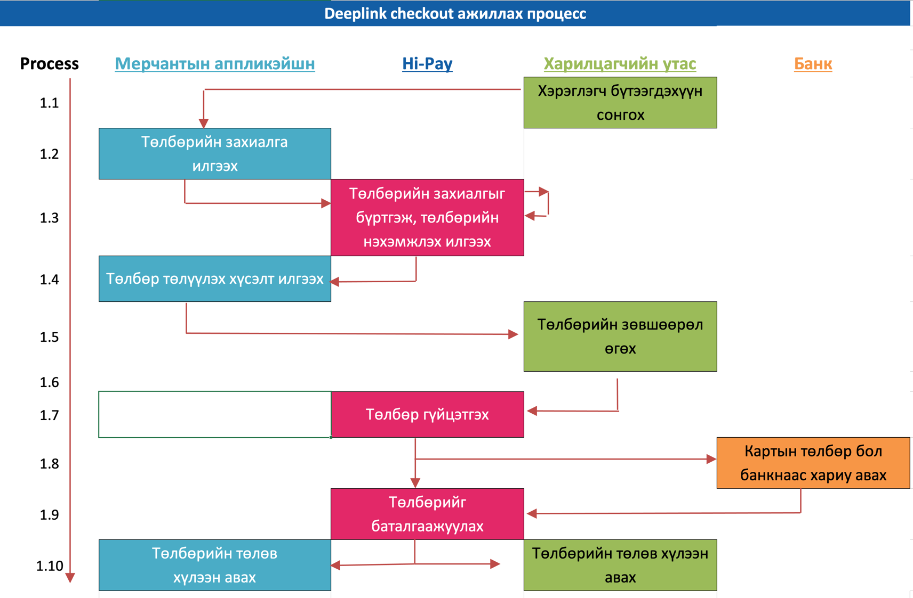

# Hi-Pay аппликэйшн руу Deeplink-р төлбөрийн нэхэмжлэл төлөх

## Танилцуулга

Бүх HiPay Wallet аппликэйшн ашиглаж буй бүх хэрэглэгч нарт мерчант өөрийн аппликэйшнээр дамжуулан бүтээгдэхүүн,
үйлчилгээгээ хялбар борлуулах боломжийг HiPay Wallet Deeplink санал болгож байна.

## Шаардлага

- Hi-Pay Wallet мерчант болон элсэх
- мерчантын client id (entityId) болон client secret авах
- Тестийн аппликэйшн суулгах (iOS, Android)

## Үйл ажиллагааны диаграмм

## APIs

1. checkout

### HiPay Wallet-руу төлбөрийн хүсэлт илгээх

Дээрх API-р үүсгэсэн төлбөрийн нэхэмжлэлийн Id-г аван Hipay wallet аппликэйш-н Deeplink-г мерчант өөрийн аппликэйшнээс
дуудаж өгнө.

#### HiPay wallet аппликэйш-н Deeplink хаяг

_hipaywallet://checkout/{CHECKOUT_ID}/{RETURN_URI}_

### Параметрийн тайлбар

| Талбарын нэр | Төрөл  | Тайлбар                                                             |
| ------------ | ------ | ------------------------------------------------------------------- |
| CHECKOUT_ID  | string | Төлбөрийн нэхэмжлэлийн Id                                           |
| RETURN_URI   | string | Төлбөр төлөлтийн дараа мерчантын аппликэйшн руу буцах Deeplink хаяг |

### Төлбөр төлөлт хийгдсэний дараа

HiPay wallet аппликэйшн мерчантын аппликэйшн руу буцах Deeplink хаяг дээр төлбөрийн мэдээлэл нэмэн дуудна.

#### Мерчантын аппликэйшн руу буцах Deeplink хаяг

_{RETURN_URI}/{CHECKOUT_ID}/{PAYMENT_ID}_

### Параметрийн тайлбар

| Талбарын нэр | Төрөл  | Тайлбар                                                           |
| ------------ | ------ | ----------------------------------------------------------------- |
| CHECKOUT_ID  | string | Төлбөрийн нэхэмжлэлийн Id                                         |
| PAYMENT_ID   | string | Төлбөр төлөлтийн Id. Хэрэв төлбөр төлөлт алдаатай үед null байна. |

Deeplink дээр ирсэн CHECKOUT_ID, PAYMENT_ID-г доорх API-г дуудан баталгаажуулна.

2. check checkout
3. check payment
