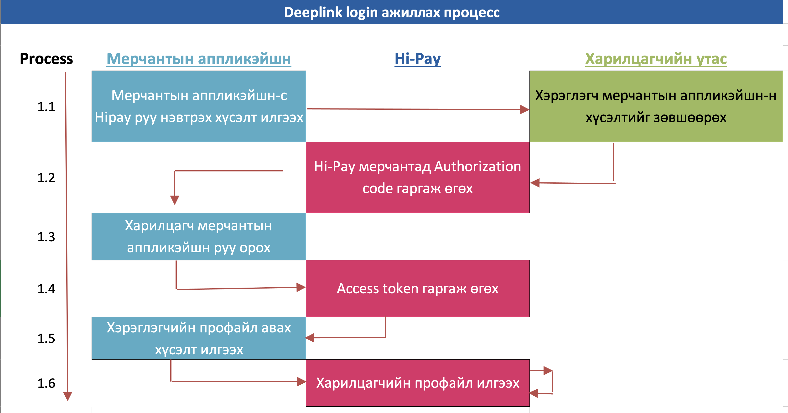

# Мерчант аппликэйшн-с хэрэглэгчийн хандалтын токен авах

## Танилцуулга

Hi-Pay мерчант өөрийн аппликэйшнаас Hi-Pay хэрэглэгчийн хандалтын токен аван тухайн хэрэглэгчийн мэдээлэлийг лавлах,
өөрийн аппликэйшндээ нэвтрүүлэх, төлбөр гүйлгээ хийх зэрэг олон боломжийг Deeplink login санал олгож байна.

## Шаардлага

- Hi-Pay Wallet мерчант болон элсэх
- мерчантын client id (entityId) болон client secret авах
- Тестийн аппликэйшн суулгах (iOS, Android)

## Үйл ажиллагааны диаграмм

## APIs

### Hi-Pay хэрэглэгчийн хандалтын токен авах

Deeplink ашиглан дараах дэс дарааллын дагуу хэрэглэгчийн хандалтын токен авна.

1. Deeplink-р Authorization Code-г лавлаж авна.

#### Hi-Pay wallet аппликэйш-н Deeplink хаяг

*hipaywallet://oauth/{ENTITY_ID}/{RETURN_URI}*

### Параметрийн тайлбар

| Талбарын нэр | Төрөл  | Тайлбар                                                             |
| ------------ | ------ | ------------------------------------------------------------------- |
| ENTITY_ID    | string | Байгууллагын код                                                    |
| RETURN_URI   | string | Мерчантын аппликэйшн руу буцах Deeplink хаяг                        |

#### Мерчантын аппликэйшн руу буцах Deeplink хаяг

*{RETURN_URI}/{code}*

### Параметрийн тайлбар

| Талбарын нэр | Төрөл  | Тайлбар                                                           |
| ------------ | ------ | ----------------------------------------------------------------- |
| code  | string | Хэрэглэгч илтгэх код. Хэрэв хэрэглэгч мэдээлэл өгөхийг зөвшөөрөөгүй үед null байна.|

2. Хэрэглэгчийн TOKEN авах

Хэрэглэгчийн TOKEN авах [энд](https://developer.hipay.mn/mini-app#getUserToken) дарж харна уу.

### Токений хэрэглээ

Токений хэрэглээг [энд](https://developer.hipay.mn/token#introductionToken) дарж харна уу.
